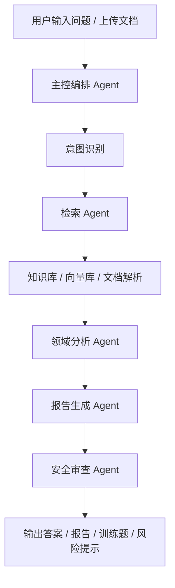

# “AI赋能，智领航空”AI Agent 参赛项目方案

## 1. 文档目的

本文档基于南昌航空大学 2026 年 4 月 2 日发布的竞赛通知，结合当前可落地的 AI Agent 技术路线，给出一份可直接用于立项、原型开发、项目书撰写和答辩准备的详细方案。

本文档不只是给出一个题目，而是尽量把以下内容一次性补齐：

- 比赛主题和约束的提炼
- 一个更容易做出成品、又符合“航空特色 + AI Agent + 落地价值”的项目方向
- 完整的系统设计思路
- 技术栈与模型选型建议
- 数据来源建议
- 开发里程碑
- 演示视频与答辩材料建议

---

## 2. 竞赛通知关键信息提炼

### 2.1 来源信息

- 微信文章标题：**“AI赋能，智领航空”第二届南昌航空大学人工智能竞赛正式启动！等你来战！**
- 微信文章发布时间：**2026-04-02 17:07**
- 主题关键词：**AI赋能，智领航空**

### 2.2 与本项目最相关的比赛要求

根据文章内容，和 AI Agent 项目最相关的信息如下：

- 大赛强调 2026 年 AI 技术发展趋势，重点围绕：
  - 智能航空
  - 具身智能
  - AI+科学
  - 智慧医疗
  - 智慧教育
- 选题范围分为三类：
  - 技术创新类
  - 应用创新类
  - 特色创新类
- 其中技术创新类中**明确提到 AI Agent 研发**，这意味着做 Agent 项目是完全贴题的。
- 应用创新类强调**实用性和落地性**，说明仅做聊天机器人不够，最好体现真实场景价值。
- 特色创新类强调**航空特色、AI 安全、可信 AI**，这对我们做“航空知识 + 安全约束 + 可追溯回答”的 Agent 非常有利。

### 2.3 初赛与决赛可确认的材料要求

从文章可稳定提取出的要求包括：

- 初赛为**线上提交作品**
- 初赛需要提交：
  - 项目文档，且**不少于 3000 字**
  - 演示视频，**不超过 10 分钟**
  - 辅证材料，如代码、实验数据、专利、软著、原型截图等
- 决赛为**线下答辩**
- 决赛需要准备：
  - PPT 演示文稿
  - 作品演示
- 评审关注维度包括：
  - 创新性
  - 技术难度
  - 实用性
  - 表达清晰度

### 2.4 关于日期字段的说明

微信页面源码中的个别日期字符在抓取后出现缺损，能够确认的是：

- 比赛包含报名、初赛、决赛三个阶段
- 报名阶段截止时间为某日 **17:00 前**
- 初赛材料提交截止时间为某日 **17:00 前**
- 决赛为某个 5 月日期的线下答辩

这里不建议把抓取后残缺的日期直接写进正式申报材料。正式提交前，应以比赛报名表、官方群通知或原始海报为准。

---

## 3. 推荐项目方向

## 项目名称

**AeroSafe Agent：面向航空维修培训与安全问答的可信多智能体平台**

### 3.1 为什么推荐这个方向

这个题目比“泛用 AI 助手”更适合参赛，原因有四点：

- **贴题性强**  
  同时覆盖“智能航空”“智慧教育”“AI Agent”“可信 AI”四个方向。

- **有航空特色**  
  聚焦航空维修培训、安全问答、事故案例学习，不容易被评委认为是普通大模型套壳。

- **可演示性强**  
  该项目天然适合录制 10 分钟视频，可以清楚演示“提问 -> 检索 -> 分析 -> 生成流程 -> 给出引用依据”的完整链路。

- **落地难度适中**  
  不需要接入真实飞控或高风险设备控制，主要做知识服务、训练支持和辅助决策，团队在有限时间内更容易做成。

### 3.2 项目定位

本项目不是自动替代工程师做维修决策，而是一个面向**航空相关学习、训练、故障排查辅助和安全知识问答**的智能体平台。

核心定位是：

- 面向学生、教师、航空相关课程团队、维修培训场景
- 提供可追溯、有引用、有安全约束的专业问答
- 基于知识库与多智能体协作，提升航空知识获取效率和训练质量

### 3.3 项目一句话定义

> 一个能够理解航空维修资料、训练手册、事故案例和用户问题，并通过多智能体协作完成检索、分析、解释、生成训练建议与报告的可信 AI Agent 系统。

---

## 4. 目标用户与典型场景

### 4.1 目标用户

- 航空类专业学生
- 航空维修培训学员
- 航空课程教师
- 竞赛评委可理解为“航空知识服务场景中的一般专业用户”

### 4.2 典型场景

### 场景一：维修知识问答

用户输入：

> 发动机异常振动排查通常应该先看哪些项目？

系统输出：

- 结构化排查步骤
- 相关知识依据
- 风险提示
- 引用来源片段

### 场景二：事故案例学习

用户输入：

> 帮我总结某类航空安全事件的常见诱因，并生成培训提醒。

系统输出：

- 事故原因归纳
- 相似案例总结
- 训练建议
- 安全红线提示

### 场景三：手册理解与问答

用户上传：

- 维修手册 PDF
- 流程图截图
- 检查单图片

系统输出：

- 关键步骤提取
- 流程说明
- 术语解释
- 注意事项

### 场景四：教学辅助

教师输入：

> 基于“航空液压系统基础”生成一套 10 道训练题，并区分基础题和综合题。

系统输出：

- 分层题目
- 参考答案
- 知识点归属
- 易错点提示

---

## 5. 项目目标与非目标

### 5.1 项目目标

- 建立一个面向航空知识场景的 Agent 系统原型
- 让系统具备“问答 + 检索 + 引用 + 分析 + 报告生成”的闭环能力
- 体现多智能体协作而非单轮聊天
- 强化安全约束，避免无依据乱答
- 完成初赛所需材料和决赛演示所需原型

### 5.2 非目标

为降低风险并提高实现成功率，本项目**不建议**做以下内容：

- 不直接接管真实飞机或机械控制
- 不生成未经审核即可执行的高风险维修指令
- 不以“完全替代人工专家”为目标
- 不把系统包装成“百分之百正确”的安全决策系统

这样做反而更符合可信 AI 和比赛答辩逻辑。

---

## 6. 系统核心能力设计

### 6.1 核心能力一：航空领域知识问答

系统对用户问题进行理解，然后调用知识库检索模块，给出带引用的答案。

关键要求：

- 回答必须可追溯
- 给出参考片段来源
- 低置信度时明确提示不确定

### 6.2 核心能力二：维修流程辅助解释

系统将维修相关文本材料拆解为：

- 步骤说明
- 前置条件
- 风险项
- 注意事项
- 禁止项

这样更容易体现“专业性”和“工程落地感”。

### 6.3 核心能力三：事故案例与安全学习

系统对事故案例或事件报告进行归纳，输出：

- 事件摘要
- 原因分类
- 风险因子
- 预防建议
- 训练提示

该能力非常适合演示 AI 在航空安全教育中的价值。

### 6.4 核心能力四：训练题与教学材料生成

系统可自动生成：

- 单选题
- 判断题
- 简答题
- 情景分析题

并附带：

- 标准答案
- 评分要点
- 关联知识点

### 6.5 核心能力五：多模态文档理解

如果时间允许，可增加图像理解能力，用于：

- 读取流程截图
- 理解检查单图片
- 解析带图文的手册页面

这一点会显著提高项目展示效果。

---

## 7. 多智能体架构设计

建议采用“主控 Agent + 专家 Agent + 安全 Agent”的结构，而不是纯对话式单 Agent。

### 7.1 Agent 角色划分

### 主控编排 Agent

负责：

- 识别用户意图
- 判断走问答、检索、报告、训练生成哪条流程
- 调度其他 Agent
- 汇总最终结果

### 检索 Agent

负责：

- 从向量库和结构化知识库中召回相关内容
- 做关键词检索 + 语义检索
- 提供引用依据

### 领域分析 Agent

负责：

- 把召回内容转换成航空领域可读结论
- 提炼关键步骤、风险点、术语解释
- 形成专业化回答

### 报告生成 Agent

负责：

- 输出训练总结
- 生成案例分析
- 生成课程辅助材料
- 生成初步答辩文稿素材

### 安全审查 Agent

负责：

- 检查幻觉风险
- 检查回答是否超出知识依据
- 对高风险问题追加免责声明
- 对缺乏依据的结论进行拦截或降级输出

### 7.2 推荐工作流

### 7.3 为什么多智能体更适合参赛

- 更能体现“AI Agent 研发”而不是简单问答机器人
- 更容易在答辩中解释系统架构与创新点
- 更便于后期扩展，例如加入视觉理解 Agent、评估 Agent、日志审计 Agent

---

## 8. 技术架构建议

### 8.1 总体架构

- 前端：Web 演示界面
- 后端：FastAPI 服务
- Agent 编排层：状态机式多智能体工作流
- 知识层：RAG 检索增强
- 模型层：指令模型 + 向量模型 + 重排模型 + 可选视觉模型
- 存储层：关系数据库 + 向量数据库 + 文件存储

### 8.2 模块拆分

建议拆成以下模块：

1. 用户交互模块  
   提供聊天问答、文件上传、案例分析、训练题生成等入口。

2. 文档处理模块  
   支持 PDF、Word、TXT、图片 OCR、分块切分、元数据标注。

3. 知识检索模块  
   实现向量召回、关键词召回、重排序、引用片段返回。

4. Agent 编排模块  
   管理主控 Agent 与子 Agent 的调用顺序和状态。

5. 安全约束模块  
   对危险回答、无依据回答进行拦截。

6. 日志评估模块  
   保存提问、检索结果、生成结果与人工评分，便于演示和后续优化。

---

## 9. 数据方案建议

### 9.1 数据来源方向

优先选择可以公开使用、且容易快速构建知识库的内容：

- 航空基础课程资料
- 公开航空安全案例
- 公开维修流程说明或训练材料
- 公开法规、规范、术语解释材料
- 团队自行整理的教学知识卡片

### 9.2 建议的数据结构

每条知识建议包含：

- 标题
- 类别
- 来源
- 正文
- 关键词
- 风险等级
- 适用场景
- 更新时间

### 9.3 可作为原型参考的数据资源

以下资源可作为项目原型阶段的数据参考或思路参考：

- [elihoole/asrs-aviation-reports](https://hf.co/datasets/elihoole/asrs-aviation-reports)  
  航空安全事件报告数据，适合事故案例分析、风险总结、事件问答。

- [sakharamg/AviationQA](https://hf.co/datasets/sakharamg/AviationQA)  
  航空问答数据，适合构建领域问答评测集。

- [ziksy/faa-aviation-training](https://hf.co/datasets/ziksy/faa-aviation-training)  
  航空训练相关数据，适合训练题生成和知识整理思路参考。

### 9.4 数据清洗建议

- 删除重复内容
- 统一术语和单位表达
- 对每一段材料保留来源字段
- 为重点知识块补充标签，如“发动机”“液压”“安全”“训练”
- 对高风险内容增加人工审核标记

---

## 10. 模型与组件选型建议

下面优先给出**学生团队可落地**的配置。

### 10.1 Agent 编排框架

首选推荐：

- [langchain-ai/langgraph](https://github.com/langchain-ai/langgraph)

备选：

- [crewAIInc/crewAI](https://github.com/crewAIInc/crewAI)

推荐 LangGraph 的原因：

- 更适合做可控工作流
- 更容易表达“状态驱动、节点编排、可追踪”
- 在答辩时更容易说明每个 Agent 的职责和执行顺序

如果团队更想快速出效果，也可以用 crewAI 做原型，但正式参赛更建议 LangGraph 这种结构化编排方式。

### 10.2 大语言模型

基于当前 Hugging Face 检索结果，推荐如下：

- [Qwen/Qwen2.5-7B-Instruct](https://hf.co/Qwen/Qwen2.5-7B-Instruct)  
  适合作为主力问答模型，能力和部署成本相对平衡。

- [Qwen/Qwen2.5-3B-Instruct](https://hf.co/Qwen/Qwen2.5-3B-Instruct)  
  如果本地资源有限，可先用 3B 版本做演示原型。

- [Qwen/Qwen2.5-1.5B-Instruct](https://hf.co/Qwen/Qwen2.5-1.5B-Instruct)  
  适合轻量化快速验证与低显存部署。

### 10.3 多模态模型

若要支持图片、截图、手册页面理解，推荐：

- [Qwen/Qwen2.5-VL-3B-Instruct](https://hf.co/Qwen/Qwen2.5-VL-3B-Instruct)

如果设备允许，也可升级为：

- [Qwen/Qwen2.5-VL-7B-Instruct](https://hf.co/Qwen/Qwen2.5-VL-7B-Instruct)

### 10.4 向量与重排模型

推荐：

- [BAAI/bge-m3](https://hf.co/BAAI/bge-m3)  
  适合多语言与通用检索场景，做航空知识库检索够用。

- [BAAI/bge-reranker-v2-m3](https://hf.co/BAAI/bge-reranker-v2-m3)  
  用于对召回结果重排序，提高引用片段质量。

### 10.5 后端与存储

- 后端框架：FastAPI
- 向量库：FAISS 或 pgvector
- 数据库：PostgreSQL
- 文档解析：PyMuPDF、unstructured、OCR 工具链
- 部署：Docker Compose

### 10.6 为什么不建议一开始就追求超大模型

学生竞赛更重要的是：

- 路线清晰
- 原型稳定
- 能跑通
- 能解释
- 能演示

如果一开始就追求极大参数模型，往往会卡在部署和响应速度上，反而不利于短期内完成完整作品。

---

## 11. 项目创新点设计

比赛中，创新点不能只写“用了大模型”，建议突出以下几个点。

### 创新点一：航空领域可信问答

系统不是直接生成答案，而是要求：

- 先检索
- 再分析
- 最后输出引用依据

这比普通聊天机器人更符合航空场景对准确性和可追溯性的要求。

### 创新点二：多智能体分工协作

将系统拆成主控、检索、分析、报告、安全审查多个 Agent，体现工程化智能体设计能力。

### 创新点三：知识服务与训练服务一体化

既能做问答，也能做：

- 案例分析
- 训练题生成
- 培训提醒
- 报告生成

这让项目既有技术创新，也有应用落地价值。

### 创新点四：面向航空特色的安全约束

面对高风险问题，系统不直接给出未经证实的执行指令，而是输出：

- 风险等级
- 建议查阅材料
- 人工复核提示

这一点很适合在答辩中强调“可信 AI”。

### 创新点五：多模态文档理解扩展能力

如果加入图片和 PDF 页面理解能力，项目会明显区别于纯文本问答系统。

---

## 12. MVP 最小可行版本

如果时间紧，建议先完成以下 MVP：

### 必做功能

- 文本问答
- 知识库检索
- 带引用回答
- 事故案例总结
- 训练题生成
- Web 演示界面

### 可选增强

- 图片/PDF 页理解
- 风险等级标注
- 语音输入输出
- 用户登录与历史记录

### MVP 判定标准

只要做到以下几点，就已经足够支撑初赛：

- 能上传知识文档并完成索引
- 能问答且引用来源
- 能针对一个航空案例生成总结
- 能生成训练题
- 能录出一段稳定流畅的演示视频

---

## 13. 开发计划建议

建议按 4 周推进。

### 第 1 周：需求收敛与数据准备

- 明确项目名称与场景边界
- 整理第一批航空知识资料
- 完成知识分类标签设计
- 搭建基础前后端框架

### 第 2 周：RAG 与单 Agent 原型

- 完成文档解析和切分
- 建立向量索引
- 打通问答与引用
- 做出最基础可演示版本

### 第 3 周：多 Agent 编排与功能增强

- 接入主控 Agent
- 增加案例分析功能
- 增加训练题生成功能
- 增加安全审查流程

### 第 4 周：打磨演示与提交材料

- 优化 UI
- 录制演示视频
- 撰写项目文档
- 准备 PPT
- 补充实验结果、系统截图与流程图

---

## 14. 演示视频脚本建议

比赛要求视频不超过 10 分钟，因此建议按以下脚本录制。

### 视频结构

### 第 1 分钟：项目背景

- 航空培训与安全知识获取成本高
- 传统资料分散，查询效率低
- 大模型有潜力，但需要可信和可追溯机制

### 第 2-3 分钟：系统架构

- 展示整体架构图
- 介绍多 Agent 分工
- 介绍知识库与安全约束

### 第 4-6 分钟：功能演示

- 演示专业问答
- 演示引用来源
- 演示事故案例总结

### 第 7-8 分钟：教学辅助能力

- 演示训练题生成
- 演示知识点归类

### 第 9 分钟：项目亮点

- 航空特色
- 可信 AI
- 多 Agent 协作
- 落地价值

### 第 10 分钟：总结

- 可扩展方向
- 应用场景
- 团队后续规划

---

## 15. 初赛项目文档建议结构

由于初赛要求不少于 3000 字，建议按以下结构撰写正式项目书：

1. 项目背景与问题定义
2. 国内外研究与应用现状
3. 项目目标与应用价值
4. 系统总体架构
5. 多智能体设计方案
6. 知识库与数据处理方案
7. 模型选型与关键技术
8. 系统实现与主要界面
9. 创新点总结
10. 实验设计与效果展示
11. 风险与可信性设计
12. 应用前景与推广价值

---

## 16. 决赛答辩 PPT 建议结构

建议准备 10 到 12 页 PPT。

### 推荐页序

1. 封面
2. 项目背景
3. 痛点分析
4. 项目目标
5. 系统架构
6. 多 Agent 流程
7. 数据与模型选型
8. 核心功能演示
9. 创新点
10. 应用价值
11. 风险控制与可信 AI
12. 总结与展望

### 答辩表达重点

- 不强调“我们用了很大的模型”
- 强调“我们做了一个有航空场景价值、可解释、可演示、可扩展的智能体系统”

---

## 17. 风险点与规避建议

### 风险一：项目做得太大

规避建议：

- 不做过多复杂子系统
- 先把问答、引用、案例分析做扎实

### 风险二：没有航空特色

规避建议：

- 所有演示样例都围绕航空维修、安全训练、航空知识场景
- 界面、数据、案例、输出模板都体现航空主题

### 风险三：评委质疑准确性

规避建议：

- 回答必须附引用
- 对高风险问题给出人工复核提示
- 明确系统是辅助工具，不是自动决策系统

### 风险四：视频演示不稳定

规避建议：

- 录屏时使用固定样例
- 预先缓存向量库
- 减少现场网络依赖

---

## 18. 推荐落地版本

如果你们希望在“完成度”和“实现难度”之间平衡，我建议采用以下版本：

### 版本定位

**赛事版 V1**

### 必备功能

- 航空知识问答
- 带引用的 RAG 检索
- 事故案例分析
- 训练题生成
- 安全提示与可信输出

### 技术配置

- LangGraph + FastAPI + PostgreSQL/FAISS
- Qwen2.5-3B-Instruct 或 Qwen2.5-7B-Instruct
- BGE-M3 + BGE Reranker

### 展示策略

- 重点展示专业场景
- 重点展示可追溯
- 重点展示多 Agent 编排

这是最适合竞赛交付的一档方案。

---

## 19. 如果还想更进一步

在完成 V1 后，可以进一步加入：

- 图片/PDF 页面理解
- 训练报告自动生成
- 多轮学习画像
- 课程知识图谱
- 语音交互
- 本地化离线部署

这些内容更适合作为决赛加分项，而不是初期必须项。

---

## 20. 最终建议

如果目标是尽快形成一个能参赛、能解释、能演示、能扩写成项目书的 AI Agent 作品，**AeroSafe Agent** 是一个非常合适的切入点。

它的优势在于：

- 选题贴合比赛主题
- AI Agent 属性明确
- 航空特色清晰
- 可信 AI 叙事完整
- 技术上可拆分、可快速落地
- 初赛和决赛都容易准备材料

换句话说，这不是“泛 AI 项目换个名字”，而是一个真正符合“AI赋能，智领航空”叙事逻辑的参赛方案。

---

## 21. 参考链接

### 比赛通知

- 微信文章原链接：<https://mp.weixin.qq.com/s/79VwkC3Nurt3UVd3OA3TQQ>

### GitHub 参考仓库

- LangGraph：<https://github.com/langchain-ai/langgraph>
- crewAI：<https://github.com/crewAIInc/crewAI>

### Hugging Face 参考模型

- Qwen2.5-7B-Instruct：<https://hf.co/Qwen/Qwen2.5-7B-Instruct>
- Qwen2.5-3B-Instruct：<https://hf.co/Qwen/Qwen2.5-3B-Instruct>
- Qwen2.5-1.5B-Instruct：<https://hf.co/Qwen/Qwen2.5-1.5B-Instruct>
- Qwen2.5-VL-3B-Instruct：<https://hf.co/Qwen/Qwen2.5-VL-3B-Instruct>
- Qwen2.5-VL-7B-Instruct：<https://hf.co/Qwen/Qwen2.5-VL-7B-Instruct>
- BAAI/bge-m3：<https://hf.co/BAAI/bge-m3>
- BAAI/bge-reranker-v2-m3：<https://hf.co/BAAI/bge-reranker-v2-m3>

### Hugging Face 参考数据集

- ASRS Aviation Reports：<https://hf.co/datasets/elihoole/asrs-aviation-reports>
- AviationQA：<https://hf.co/datasets/sakharamg/AviationQA>
- FAA Aviation Training：<https://hf.co/datasets/ziksy/faa-aviation-training>

---

## 22. 评委视角下的选题比较

如果站在评委角度，通常会同时看四件事：

- 题目是否贴合比赛主题
- 是否体现技术深度
- 是否有真实场景价值
- 是否能在有限时间内做出稳定原型

基于这四个维度，可以把常见选题分成三档。

### 22.1 方案 A：AeroSafe Agent

定位：

- 航空维修培训
- 安全问答
- 案例分析
- 训练题生成

优点：

- 航空特色明确
- Agent 属性明确
- 容易体现可信 AI
- 演示链路完整
- 训练和教育场景容易讲清楚

风险：

- 数据整理需要投入一定时间
- 如果回答没有引用，容易被质疑专业性

综合判断：

**这是最均衡、最适合参赛的一档方案。**

### 22.2 方案 B：航空科普传播 Agent

定位：

- 面向大众或校内宣传
- 生成航空知识科普内容
- 做互动式讲解

优点：

- 容易做出界面效果
- 演示轻松
- 数据门槛低

风险：

- 技术深度容易不足
- 会被评委质疑“是不是普通内容生成工具”
- 航空专业性相对不强

综合判断：

适合做备用方向，不适合作为主打冲奖项目。

### 22.3 方案 C：航空手册多模态解析 Agent

定位：

- 重点做 PDF、图像、流程图解析
- 做多模态理解和步骤提取

优点：

- 技术感强
- 演示效果好
- 多模态是加分项

风险：

- 难度偏高
- 容易卡在 OCR、版面解析、视觉模型效果稳定性
- 如果只展示“看图说话”，落地故事可能不如方案 A 完整

综合判断：

更适合作为方案 A 的增强模块，而不建议一开始就单独立项。

---

## 23. 冲奖策略建议

如果目标不是“交作业”，而是尽量冲更高名次，建议把精力放在下面四件事上。

### 23.1 不要做成普通聊天机器人

评委最容易否定的一类项目，就是换了主题词的通用问答系统。

规避方式：

- 所有样例都围绕航空知识
- 所有回答都要有引用来源
- 所有功能都围绕训练、安全、流程辅助展开

### 23.2 一定要做“引用 + 风险提示”

如果项目能展示：

- 检索到的依据片段
- 低置信度提示
- 高风险问题的人审建议

那么可信 AI 这条线会非常完整。

### 23.3 一定要准备评测结果

哪怕不是很复杂，也要准备简单评测。

建议最少准备：

- 20 条航空问答测试集
- 10 条事故案例总结测试集
- 10 条训练题生成样例

然后统计：

- 回答正确率
- 引用命中率
- 用户主观满意度

有评测，项目就从“展示型作品”变成“有实验支撑的作品”。

### 23.4 录视频时只演示最稳的链路

视频不需要展示所有功能，而要展示最稳定、最能打动评委的 3 条链路：

1. 专业问答 + 引用来源
2. 事故案例总结 + 风险提示
3. 训练题生成 + 知识点归类

这三条已经足以支撑一个完整的参赛叙事。

---

## 24. 建议你们现在就开始做的事

如果准备正式推进，我建议下一步按这个顺序执行：

1. 先定项目名、场景边界、展示对象  
   建议直接采用 AeroSafe Agent 这一版，不要再继续扩散题目。

2. 先整理第一批知识库  
   优先整理 50 到 100 条高质量航空知识片段，比一开始堆很多杂乱文档更有效。

3. 先做单链路 MVP  
   先打通“提问 -> 检索 -> 生成引用答案”，不要一开始做太多花哨功能。

4. 再补案例分析和训练题生成  
   这两个功能最适合做比赛视频。

5. 最后再补视觉理解和 UI 包装  
   多模态和界面都是加分项，但不是最先应该做的核心项。

---

## 25. 我对这个项目的最终判断

如果你们团队现在需要一个：

- 主题贴合
- 技术上说得清
- 时间上做得出
- 材料上容易包装
- 视频里容易演示

的 AI Agent 项目，那么 **AeroSafe Agent** 基本就是当前这次比赛里非常稳的一条路线。

它不属于“最炫但最难落地”的方向，而属于“评委更容易理解、你们更容易做成、完成度更容易拉高”的方向。

对学生竞赛来说，**完成度、可信度、场景价值**通常比“模型参数更大”更重要。
