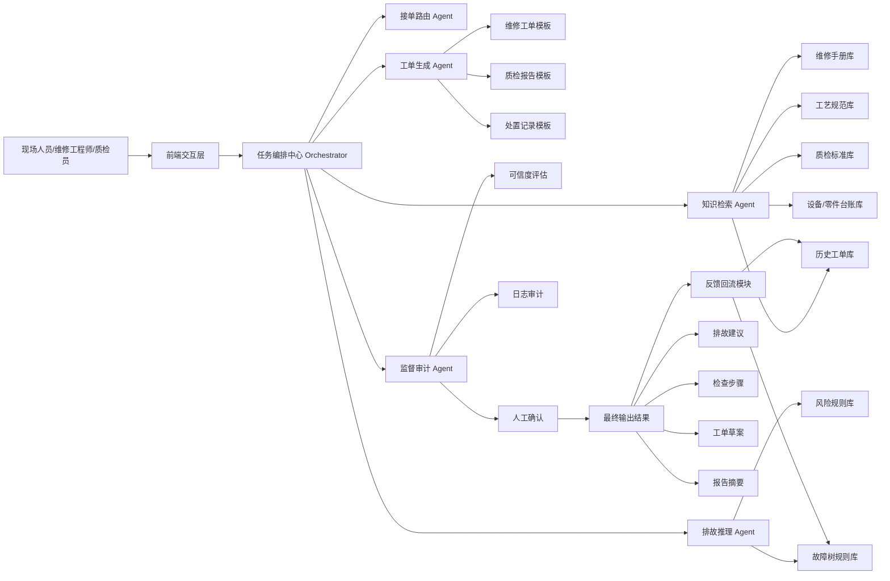

可以，下面我直接按**比赛可用版本**给你写。

我先默认项目名为：

# **翼修通：面向航空制造与运维场景的智能排故协同 Agent**

这个题目适合你们前面定的方向：**智能航空 + 航空工业 + 智能制造 + AI Agent 应用**。
它不只是问答助手，而是一个能完成“**故障理解 → 知识检索 → 排故推理 → 工单生成 → 人工确认 → 闭环反馈**”的垂直智能体。

------

# 一、比赛版技术方案大纲

## 1. 项目背景

航空制造与运维场景中，设备异常、工艺偏差、零件质检问题和维修排故任务往往具有以下特点：

- 故障现象复杂，诊断依赖经验
- 维修手册、工艺标准、历史工单分散，检索效率低
- 新人对 SOP 不熟，易漏检、误判
- 人工生成工单、排故建议和记录报告耗时较长
- 处理流程缺乏统一闭环，知识难以沉淀复用

因此，航空工业场景迫切需要一个能够**理解任务、调用知识、辅助决策、自动生成处置方案并形成闭环**的 AI Agent 系统。

------

## 2. 项目目标

构建一个面向航空制造与运维场景的智能排故协同 Agent，实现以下目标：

1. 支持自然语言、故障码、图像描述等多模态输入
2. 自动检索维修手册、工艺规范、历史案例和标准流程
3. 基于故障现象生成可解释的排故路径与检查建议
4. 自动生成工单草案、处置建议和记录报告
5. 支持人工确认与反馈回流，实现知识闭环优化

------

## 3. 应用场景

### 场景一：设备故障排查

现场人员输入故障码、异常现象或上传现场照片，Agent 自动分析并生成排故建议。

### 场景二：制造工艺偏差处置

当工艺参数偏离标准范围时，Agent 自动匹配工艺规范，给出调整建议和风险提示。

### 场景三：零部件质检协同

系统识别零件缺陷或异常描述后，自动查询标准并给出处置建议，生成质检报告草案。

### 场景四：维修培训与知识辅助

针对新人维修人员，Agent 可作为维修训练助手，提供 SOP 指导、术语解释和案例学习支持。

------

## 4. 项目总体方案

本项目采用**“大模型 + 检索增强 + 规则约束 + 多 Agent 协同”**的技术路线。

核心思路是：

- 用 **大模型** 负责理解问题、组织回答、生成工单和报告
- 用 **RAG 检索增强** 连接专业知识库，避免胡编
- 用 **规则引擎** 保证排故流程和工艺流程符合行业规范
- 用 **多 Agent 分工协作** 提升系统可解释性、模块化与扩展性
- 用 **人工确认机制** 保证关键决策可控、可审计

------

## 5. 系统架构设计

系统由五类核心 Agent 组成：

### 5.1 接单路由 Agent

负责识别输入类型和任务意图，判断当前任务属于故障排查、工艺偏差、质检协同还是知识问答。

### 5.2 知识检索 Agent

从维修手册、SOP、故障案例库、工艺规范库、质检标准库中检索相关内容，返回高相关证据片段。

### 5.3 排故推理 Agent

结合用户输入、故障码、检索证据和规则库，生成结构化排故路径，包括：

- 可能原因
- 优先检查项
- 建议操作步骤
- 风险等级

### 5.4 工单生成 Agent

将排故结论自动整理为：

- 工单草案
- 维修建议
- 检查记录
- 报告摘要

### 5.5 监督审计 Agent

检查回答是否越权、是否缺乏依据、是否跳过必要步骤，并输出可信度提示，保证系统安全可用。

------

## 6. 数据与知识来源

系统所依赖的知识主要来自以下几类：

- 维修手册与技术文档
- 工艺规程与标准操作流程
- 历史工单与故障处置记录
- 质检标准与缺陷案例库
- 零部件与设备台账信息
- 专家经验知识与常见问题总结

为了适配比赛展示，可以先构建一个**模拟航空维修知识库**，包含：

- 若干典型故障码
- 若干常见排故案例
- 工单模板
- 简化版工艺规范与质检标准

------

## 7. 关键技术设计

### 7.1 检索增强生成 RAG

将维修手册、案例库等文档向量化，用户提问时优先检索相关知识片段，再交给大模型生成答案。

### 7.2 故障树 + 规则约束推理

在大模型推理之外，引入规则库：

- 某类故障必须先断电检查
- 某类异常必须优先核查传感器
- 某类缺陷必须升级人工复核

这样能增强专业可信度。

### 7.3 多 Agent 编排

将复杂任务拆分为理解、检索、推理、生成、审计等阶段，降低单体模型一次性完成全部任务的风险。

### 7.4 人在回路 Human-in-the-Loop

关键步骤由人工点击确认后再进入下一环节，符合工业场景对安全性和可控性的要求。

### 7.5 闭环学习机制

人工最终修改后的工单、反馈意见和处置结果会回流知识库，持续优化系统表现。

------

## 8. 创新点设计

比赛里不要把创新写得太虚，建议就写这 4 点：

### 创新点一：从问答助手升级为任务闭环 Agent

系统不是简单回答问题，而是完成从故障输入到工单生成的完整流程。

### 创新点二：专业知识检索与规则推理融合

将大模型语言能力和航空维修规则约束结合，提高结果可靠性。

### 创新点三：多 Agent 协同机制

通过任务拆分提升复杂工业问题的处理效率与可解释性。

### 创新点四：可审计的人工确认闭环

关键结论必须由人工确认，兼顾智能化与工业安全性。

------

## 9. 核心功能模块

### 9.1 智能故障受理

支持文本输入、故障码输入、图片描述输入。

### 9.2 专业知识检索

自动检索相关手册、规范、案例和历史工单。

### 9.3 排故路径生成

输出故障原因分析、检查顺序和处置建议。

### 9.4 工单自动生成

自动生成维修工单、质检报告或处置记录草案。

### 9.5 风险提示与人工确认

对高风险建议增加显式提示，支持人工审核确认。

### 9.6 结果追踪与知识回流

记录每次处置结果，构建持续优化的知识闭环。

------

## 10. 技术实现方案

### 前端

- Web 页面或轻量管理端
- 展示故障输入、推理过程、检索证据、工单结果

### 后端

- FastAPI / Spring Boot 均可
- 编排 Agent 工作流
- 对接向量库、规则引擎和文档库

### 大模型层

- 负责任务理解、文本生成、报告生成
- 可接入通用 LLM

### 检索层

- 向量数据库存储文档嵌入
- 文档切片、召回、重排序

### 规则层

- 维护排故规则、工艺规则、质检规则
- 对高风险操作进行拦截或提醒

### 数据层

- 维修知识库
- 工艺规范库
- 历史工单库
- 设备与零件信息库

------

## 11. 比赛版 MVP 范围

比赛阶段不建议做太重，建议只做一个完整闭环：

### 推荐 MVP

**“设备故障排查 + 工单自动生成”**

只需跑通以下链路：

1. 输入故障码或故障现象
2. 检索维修手册与历史案例
3. 生成排故步骤
4. 输出维修建议
5. 自动生成工单草案
6. 人工确认并保存

这条链最稳，最像真正的 AI Agent。

------

## 12. 预期效果

项目预期能带来以下价值：

- 缩短故障定位时间
- 提高维修建议标准化程度
- 降低新手人员上手门槛
- 提升工单生成效率
- 促进知识沉淀与经验复用

------

## 13. 可扩展方向

后续可以扩展为：

- 航空零件质检闭环 Agent
- 工艺偏差诊断 Agent
- 数字孪生工艺决策 Agent
- 航空维修培训教练 Agent
- 具身巡检机器人协同 Agent

------

# 二、功能架构图

下面这张你可以直接复制进 Markdown，用 Mermaid 渲染。

------

# 三、比赛展示时的功能架构讲解话术

你讲图的时候，不要逐模块死讲，直接按链路说：

**“我们的系统从前端接收故障描述或故障码后，首先由任务编排中心进行任务拆解。接单路由 Agent 识别当前属于故障排查还是质检场景；知识检索 Agent 从维修手册、工艺规范和历史工单中召回证据；排故推理 Agent 结合规则库生成结构化排故路径；工单生成 Agent 自动输出维修工单草案；最后由监督审计 Agent 给出可信度评估并保留人工确认入口，形成一个可控、可审计、可闭环的工业 AI Agent 系统。”**

这段话比赛里很好用。

------

# 四、5 分钟 Demo 脚本

下面这版是**比赛上真正能讲的脚本**。

------

## Demo 目标

展示系统如何在一个典型航空制造/运维场景中，完成：

**故障输入 → 知识检索 → 排故推理 → 工单生成 → 人工确认 → 闭环保存**

------

## Demo 场景设定

### 示例场景

某航空制造车间设备出现异常报警：

- 故障码：`E-204`
- 故障现象：设备运行时振动异常，伴随温度偏高
- 工程师希望快速判断原因并生成处置工单

------

## Demo 时长分配

### 0:00 - 0:30 项目开场

**讲稿：**

“大家好，我们的项目是‘翼修通——面向航空制造与运维场景的智能排故协同 Agent’。它面向航空工业中的设备故障排查和维修协同场景，解决人工检索慢、经验依赖强、工单生成低效的问题。”

**画面：**

- 首页
- 项目标题
- 一句话价值说明

------

### 0:30 - 1:20 故障输入

**讲稿：**

“这里我们模拟一个典型设备异常场景。工程师输入故障码 E-204，并补充现场现象：振动异常、温度偏高。系统会自动识别这是一个故障排查任务，并启动多 Agent 协同流程。”

**画面操作：**

- 输入故障码
- 输入故障描述
- 点击“开始诊断”

------

### 1:20 - 2:10 知识检索展示

**讲稿：**

“接下来，知识检索 Agent 会自动从维修手册、历史案例和工艺规范中召回相关证据。这里展示的是系统检索到的三类信息：相关故障码解释、历史相似工单，以及对应的标准检查流程。”

**画面操作：**

- 显示检索结果列表
- 高亮显示几条证据片段
- 标注来源，如维修手册、案例库、工艺规范

**这里一定要强调一句：**
“系统的建议不是凭空生成，而是建立在知识证据基础上的。”

------

### 2:10 - 3:10 排故推理展示

**讲稿：**

“在召回证据后，排故推理 Agent 会结合规则库输出结构化排故路径。当前系统给出的优先排查方向包括：传动部件异常、冷却系统异常和传感器漂移。同时系统会按照维修 SOP 生成推荐检查顺序，并给出风险提示。”

**画面操作：**

- 展示“可能原因 Top3”
- 展示“推荐检查步骤”
- 展示“风险等级/优先级”

**建议画面中有这种结构：**

- 可能原因
- 检查顺序
- 风险提示
- 建议措施

------

### 3:10 - 4:00 工单自动生成

**讲稿：**

“在确认诊断建议后，工单生成 Agent 会自动整理出维修工单草案，包括故障描述、建议检查项、处置建议和执行记录模板。工程师无需再从零填写，大幅提升效率。”

**画面操作：**

- 点击“生成工单”
- 显示工单草案页面
- 展示字段：
  - 工单编号
  - 故障描述
  - 建议步骤
  - 风险等级
  - 责任人
  - 备注说明

------

### 4:00 - 4:35 人工确认与闭环

**讲稿：**

“工业场景中，AI 不能直接替代人工决策，因此我们设计了人工确认闭环。工程师可以对建议进行修改、确认或驳回，确认后的结果会回流到系统中，持续优化后续诊断效果。”

**画面操作：**

- 点击“人工确认”
- 修改一条建议
- 点击“确认提交”
- 显示“已写入案例库/知识库”

------

### 4:35 - 5:00 结尾总结

**讲稿：**

“我们的项目把传统的知识问答升级成了面向航空工业场景的任务闭环 Agent。它不仅能理解故障、调用知识、生成建议，还能输出可执行工单，并在人机协同中不断优化，具备明确的产业落地价值。”

**画面：**

- 最终结果总览
- 一句话总结价值：
  - 提升排故效率
  - 降低经验依赖
  - 强化知识沉淀
  - 促进工业智能化升级

------

# 五、比赛答辩时的高频问答准备

## 1. 你们的项目为什么是 Agent，不是普通问答系统？

**回答：**
因为系统不止做文本回答，而是具备任务理解、知识检索、排故推理、工单生成、人工确认和反馈闭环等完整执行链路，能够完成具体任务，而不是只提供聊天式信息查询。

## 2. 你们的创新点是什么？

**回答：**
创新主要体现在三个方面：
第一，构建了面向航空工业场景的排故闭环 Agent；
第二，将专业知识检索与规则推理结合，提高了可信度；
第三，采用多 Agent 协同和人工确认机制，使系统具备工业场景所需的可解释性与可控性。

## 3. 这个项目的落地价值在哪里？

**回答：**
它可以降低人工检索和经验判断成本，提高维修与排故效率，帮助新手快速上手，同时把分散经验沉淀为可复用知识，适合向航空制造、设备运维和工业维修等场景迁移。

## 4. 你们现在的演示数据不是真实航空数据，如何证明可行？

**回答：**
比赛阶段采用模拟场景主要是为了验证系统流程和架构可行性。我们的重点在于证明 Agent 的闭环能力和技术路线是成立的，后续可以通过接入真实企业文档、工单和设备记录实现工程化部署。

------

# 六、你们做 PPT 时建议放的 6 页结构

1. **项目背景与痛点**
2. **项目目标与总体方案**
3. **系统功能架构图**
4. **核心技术与创新点**
5. **Demo 流程展示**
6. **应用价值与未来拓展**

------

# 七、最适合直接放到申报书里的项目摘要

你可以直接用这一段：

**“翼修通”是一款面向航空制造与运维场景的智能排故协同 Agent。项目围绕航空工业中故障排查效率低、知识分散、经验依赖强、工单生成耗时长等问题，构建了集任务理解、专业知识检索、规则约束推理、工单自动生成与人工确认闭环于一体的多 Agent 协同系统。该系统可辅助工程师快速定位问题、生成结构化处置建议，并将处置结果回流知识库，实现持续优化。项目具有明确的产业应用价值，可拓展至设备运维、工艺诊断、零件质检与维修培训等多个智能制造场景。”**

------

